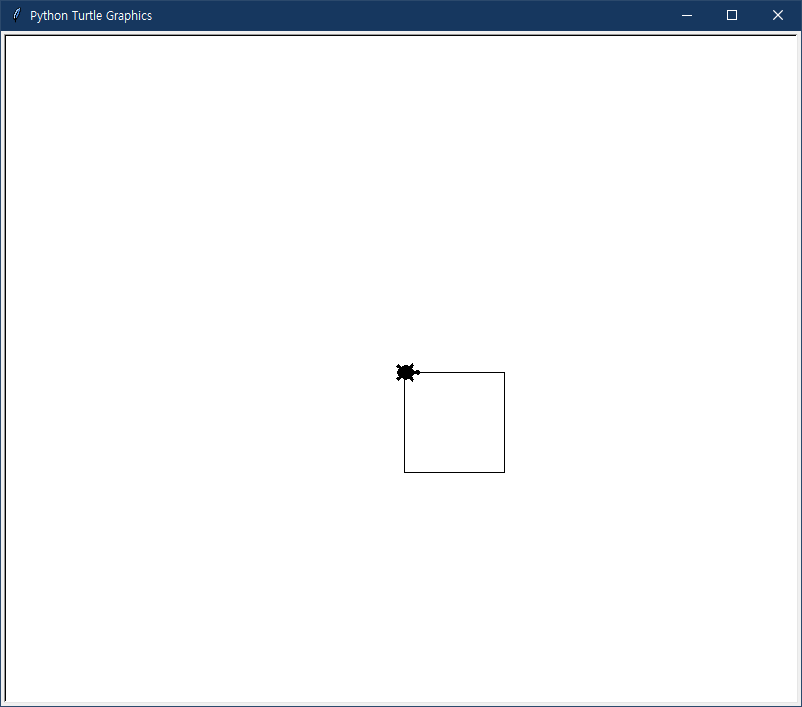
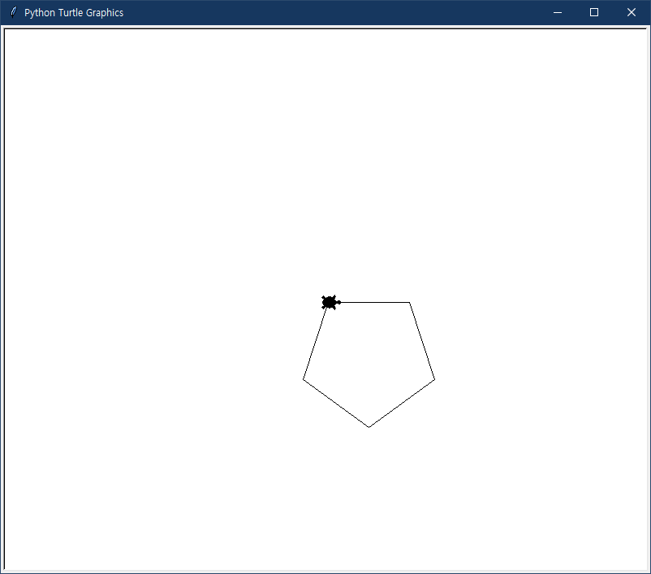
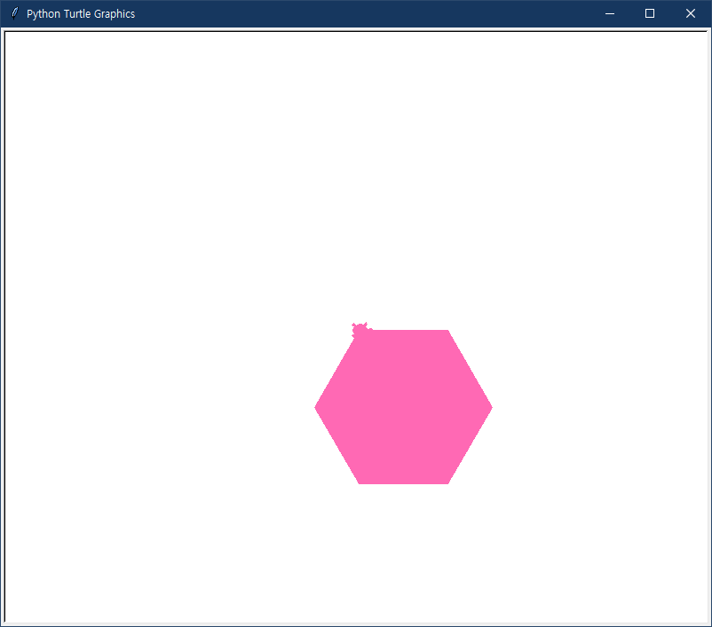
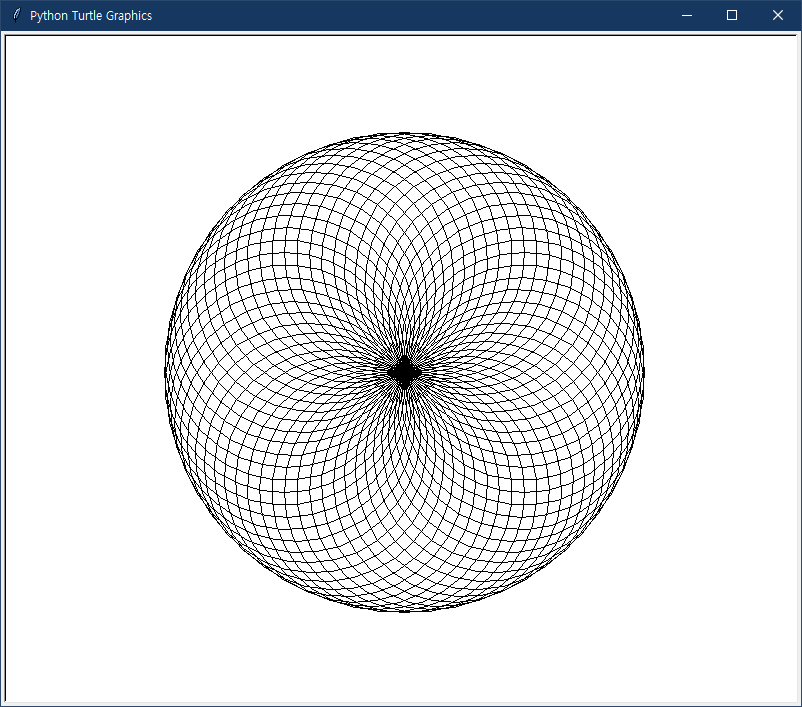

# UNIT 21 터틀 그래픽스로 그림 그리기
터틀 그래픽스 모듈을 사용해서 간단한 그림을 그려봅니다.

## 터틀 그래픽스 창 불러오기
```python
import turtle as t
t.shape('turtle')
```

## 사각형 그리기
```python
import turtle as t

t.shape('turtle')

for i in range(4):
    t.forward(100)   # 앞으로 100픽셀만큼 이동
    t.right(90)      # 오른쪽으로 90도 회전
```
- 결과:<br>


## 오각형 그리기
```python
import turtle as t

t.shape('turtle')

for i in range(5):
    t.forward(100)
    t.right(360/5)
```
- 결과:<br>


## 다각형에 색칠하기
```python
import turtle as t

t.shape('turtle')
t.color('#FF69B4')
t.begin_fill()
for i in range(6):
    t.forward(100)
    t.right(360/6)
t.end_fill()
```
- 결과:<br>


## 복잡한 도형 그리기
```python
import turtle as t

n = 60
t.shape('turtle')
t.speed('fastest')
for i in range(n):
    t.circle(120)
    t.right(360 / n)
```
- 결과:<br>
